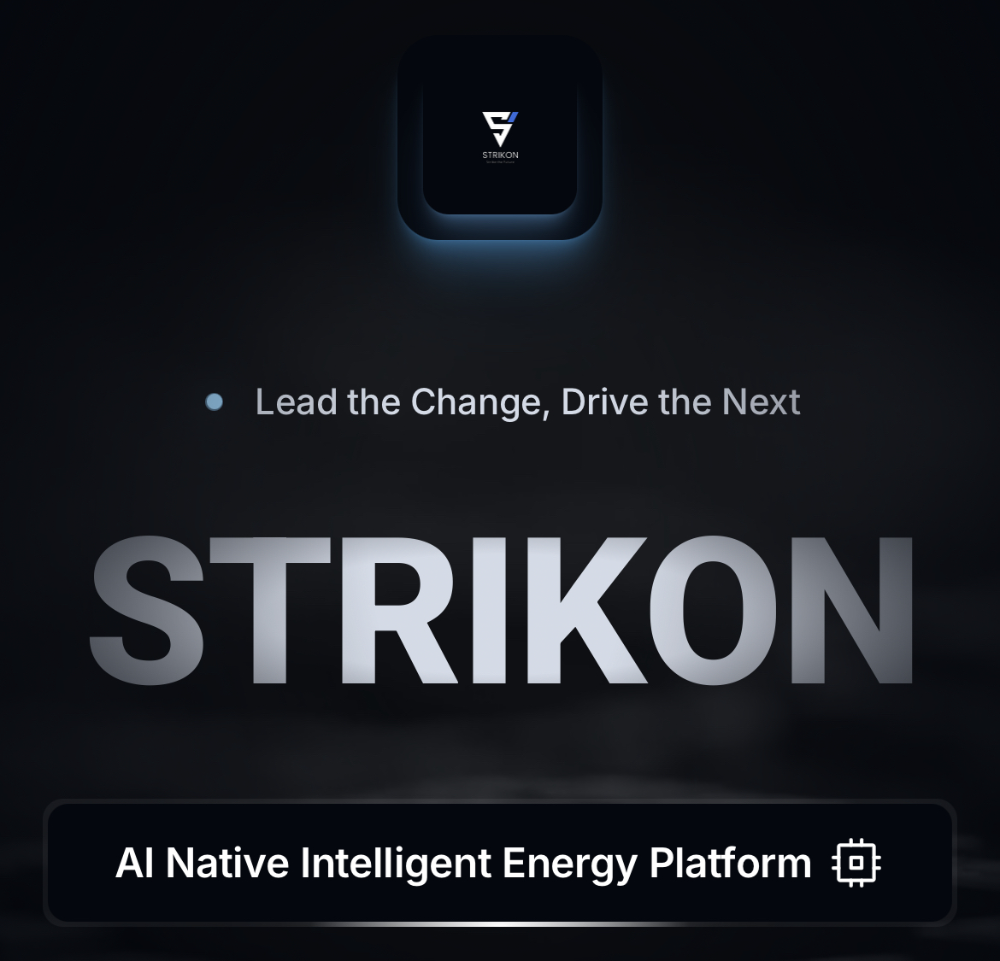

<div align="center">

# EnergyFi

### Energy RWA — Tokenising Real Infrastructure on Avalanche

<br/>


<br/>
<sub>by <b>Wingside AI</b></sub>

[](https://www.avax.network/)
[](https://soliditylang.org/)
[](https://hardhat.org/)
[](https://flutter.dev/)

</div>

---

## TL;DR

> South Korea's **STO Act passed 3 weeks ago (Jan 15 2026)** — a 1-year grace period to define the market leaders has begun.
> EnergyFi tokenises **real energy infrastructure** as on-chain securities, starting with **V2G (Vehicle-to-Grid)** charging stations.
>
> Built on **[STRIKON](https://strikon.io)** — a production-grade EV-charging platform (30+ microservices, launching June 2026) — by a team that builds the **chips, firmware, and embedded systems** powering the hardware.

This is not a blank-slate hackathon project. The infrastructure is real, the regulation is live, and Avalanche is the bridge to global institutional capital.

---

## What Makes This Different

| Typical Hackathon Team | EnergyFi |
| :--- | :--- |
| Starts from scratch | **Built on STRIKON — 30+ microservices, launching June 2026** |
| Mock data only | Production-grade interfaces defined; mock JSON mirrors real schema |
| Software only | **Chip → Firmware → Platform → Chain** — we own the full stack |
| No regulatory path | **STO Act (Jan 2026) passed — 1-year window to capture market** |
| Web demo | **Flutter native mobile app — real user experience** |
| Proof of concept | Production-ready architecture (Avalanche Subnet + C-Chain) |

> *"The infrastructure is real, the regulation is live, and we're building the RWA layer on Avalanche to connect it all."*

---

## Why Avalanche?

We have **1 year** to capture the market before the grace period ends. Avalanche is the fastest path:

| Need | Solution | Why only Avalanche? |
| :--- | :--- | :--- |
| **Regulatory speed** | ERC-3643 + Subnet permissioning | Compliance-ready out of the box — no custom framework needed |
| **Global capital pipeline** | C-Chain (public L1) | Institutional DeFi ecosystem to connect Korean RWA assets with global liquidity |
| **IoT-scale data ingestion** | Wingside Subnet (custom L2) | Sovereign chain with near-instant finality and low gas for high-frequency device data |
| **FinTech-grade reliability** | Avalanche consensus | Absolute finality and data consistency required for securities settlement |

Avalanche is the only ecosystem where you can **spin up a dedicated chain for your use case** while settling on a shared, liquid public chain — without a third-party bridge.

---

## Why Now?

**The regulatory floodgates opened 3 weeks ago.**

South Korea's **STO Act passed on Jan 15 2026**, with a **1-year grace period** — the race to define market leaders starts now.

| Signal | What it means |
| :--- | :--- |
| **STO Act passed (Jan 15 2026)** | Tokenised securities on real-world assets are now legal — first-mover advantage is everything |
| **1-year grace period** | Regulatory framework is being finalized — teams that ship first will set the standard |
| **V2G (Vehicle-to-Grid) growth** | EV batteries absorb surplus energy, sell back to grid — our beachhead market |
| **AI datacenter boom → nuclear buildout** | Nuclear can't ramp down — surplus energy needs distributed storage like V2G |
| **Beyond EV charging** | Same architecture extends to ESS, solar, and other distributed energy resources |

> STRIKON already has the energy infrastructure. EnergyFi adds the **RWA tokenisation layer** on Avalanche — compliant issuance, secondary market, and yield — at exactly the moment regulation allows it.

---

## STRIKON Platform — Built & Launching Soon

<div align="center">

<br/><br/>
<table>
<tr>
<td align="center"><b>Login</b></td>
<td align="center"><b>Home Dashboard</b></td>
<td align="center"><b>Station Map</b></td>
<td align="center"><b>Live Charging</b></td>
<td align="center"><b>Wallet & History</b></td>
</tr>
<tr>
<td></td>
<td></td>
<td></td>
<td></td>
<td></td>
</tr>
</table>
</div>

> **At launch (June 2026)**: live data via STRIKON Platform API · **Hackathon demo**: same flow on realistic mock JSON matching production schema

---

## Why This Team — Chip-to-Chain

Most RWA projects start at the API layer and trust external data. **We start at the hardware.**

```
Chip  →  Firmware  →  Embedded  →  Platform (STRIKON)  →  Blockchain (Avalanche)
└─────── Built by Wingside (20+ years hardware leadership) ──────┘   └── EnergyFi ──┘
```

| Layer | What we control | Why it matters |
| :--- | :--- | :--- |
| **Hardware** | Custom charging modules, metering ICs | Data is signed at the source — no API tampering possible |
| **Firmware** | Embedded real-time OS, OCPP stack | Tamper-evident telemetry before it ever hits the network |
| **Platform** | STRIKON (30+ microservices) | Production-grade data pipeline, already built |
| **Blockchain** | EnergyFi on Avalanche | RWA tokenisation with FinTech-grade consistency |

> When the asset backing your STO is verified from the chip level up, **the trust model is fundamentally different** from projects that scrape third-party APIs.

---

## APEX Engine — AI-Powered Investment Intelligence

<div align="center">
<table>
<tr>
<td align="center"><b>Investment Score Map & AI Recommendations</b></td>
<td align="center"><b>Portfolio Analytics & Demand Heatmap</b></td>
</tr>
<tr>
<td></td>
<td></td>
</tr>
</table>
</div>

APEX analyses every charging station and outputs:

| Output | Detail |
| :--- | :--- |
| **Investment Score** | NPV, IRR, payback period — per station |
| **Risk Grade** | Revenue stability, utilization trend, equipment health, competition |
| **AI Signal** | UNDERVALUED / FAIR VALUE / OVERVALUED |
| **Revenue Forecast** | Monthly projections with confidence intervals |
| **Synergy Analysis** | Cross-station portfolio optimisation |

> 📖 Full interface schema: [09_Interface_Spec.md](docs/09_Interface_Spec.md)

---

## Architecture

<div align="center">

</div>

> 🔗 [View interactive version with hover details](https://htmlpreview.github.io/?https://github.com/Seon-ung/EnergyFi/blob/main/docs/architecture-diagram.html)

---

## Token Lifecycle

**Real-World Asset → On-Chain Security → Investor Yield** in 7 steps:

| Step | Component | What happens |
| :---: | :--- | :--- |
| ① | **STRIKON API** | kWh & revenue data (mock JSON for demo, live API at launch) |
| ② | **APEX Engine** | AI valuation — NPV, IRR, risk score |
| ③ | **Oracle Relay** | Push verified data on-chain |
| ④ | **EnergyToken** | Mint STO tokens (KYC-gated) |
| ⑤ | **EnergyDEX** | P2P order matching *(Phase 2)* |
| ⑥ | **RevenueVault** | Distribute revenue to token holders |
| ⑦ | **Flutter App** | Investors view & claim earnings |

> 📖 Full detail: [08_Token_Lifecycle.md](docs/08_Token_Lifecycle.md)

---

## Tech Stack

| Layer | Technology |
| :--- | :--- |
| **Smart Contracts** | Solidity ^0.8.20 · Hardhat 3 · OpenZeppelin ^5.3 · Lightweight ERC-3643 |
| **Blockchain** | Avalanche C-Chain + Custom Subnet (Subnet-EVM) |
| **Backend** | TypeScript · Node.js 24 · ethers.js ^6.14 |
| **AI** | Python · Claude API (APEX Engine) |
| **Mobile** | Flutter ^3.7 · Riverpod · WalletConnect v2 |

---

## Roadmap

| Phase | Milestone | Status |
| :--- | :--- | :---: |
| **Week 1–2** | STO smart contracts (lightweight ERC-3643) · Flutter scaffold · Mock API | ✅ |
| **Week 3–4** | Revenue → Token issuance flow · P2P trading · AI valuation | 🔧 |
| **Week 5** | End-to-end integration · UI polish · Edge cases | ⬜ |
| **Week 6** | Pitch deck · Live demo rehearsal · Documentation | ⬜ |

---

## Documentation

| Document | Description |
| :--- | :--- |
| [**Architecture Diagram**](docs/architecture-diagram.html) | Interactive system architecture (HTML) |
| [00 Project Overview](docs/00_Project_Overview.md) | Vision, differentiators, tech stack |
| [01 Architecture](docs/01_Architecture.md) | System architecture & hybrid topology |
| [02 Smart Contract Spec](docs/02_Smart_Contract_Spec.md) | Contract specifications (Phase 1 / 2) |
| [03 Environment Setup](docs/03_Environment_Setup.md) | Development environment setup |
| [04 Deployment Guide](docs/04_Deployment_Guide.md) | 5-unit deployment procedure |
| [05 Regulatory Framework](docs/05_Regulatory_Framework.md) | Regulatory & compliance |
| [06 Oracle Relay Spec](docs/06_Oracle_Relay_Spec.md) | Oracle Relay service spec |
| [07 Frontend Spec](docs/07_Frontend_Spec.md) | Flutter mobile app spec |
| [08 Token Lifecycle](docs/08_Token_Lifecycle.md) | Token lifecycle: Data → Yield |
| [09 Interface Spec](docs/09_Interface_Spec.md) | STRIKON ↔ EnergyFi interface schemas (8 APIs) |

<details>
<summary><b>Quick Start (click to expand)</b></summary>

```bash
git clone https://github.com/Seon-ung/EnergyFi.git
cd EnergyFi

# Smart Contracts
cd contracts/c-chain && npm install && npx hardhat compile
cd ../subnet && npm install && npx hardhat compile

# Oracle Relay
cd ../../services/oracle-relay && npm install

# Flutter App
cd ../../frontend && flutter pub get && flutter run
```

> 📖 Full guide: [03_Environment_Setup.md](docs/03_Environment_Setup.md)

</details>

---

## License

MIT © 2026 Wingside AI EnergyFi Team
